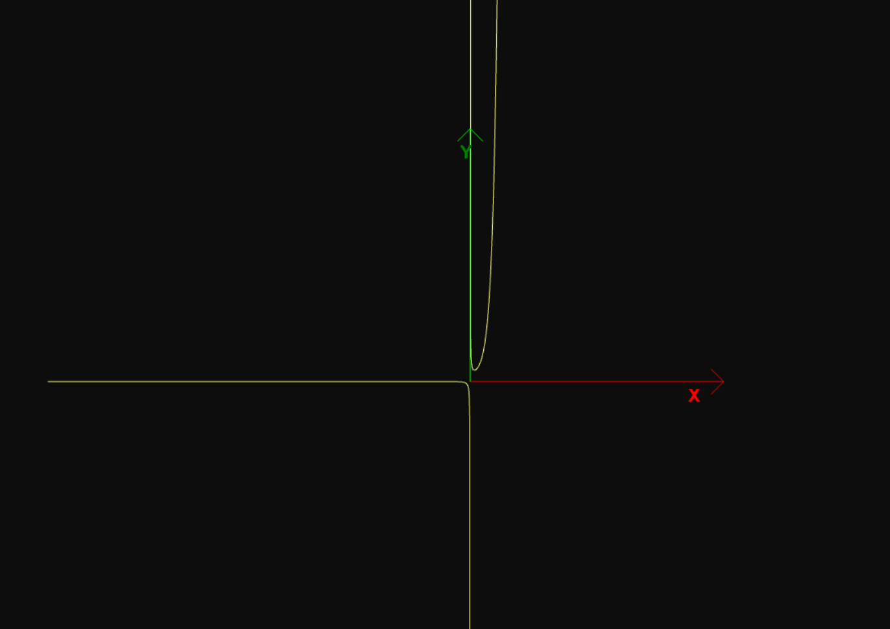

## Asymptotic functions

It tries (but does not accomplish) to draw 2d functions having into account asymptotes.

## Motivation

I am learning typescript and i wanted to try draw any 2d function given the formulae.
It is not exact from a calculus point of view but i wanted to see if it is easy to use [Babylon.js](https://github.com/BabylonJS/Babylon.js) to draw graphs of given functions even if they are not continous.

## Code style

It uses airbnb eslint-config-airbnb-typescript with typescript-eslint plugin for eslint.

## Screenshots



## Built with

- [Babylon.js](https://github.com/BabylonJS/Babylon.js)
- [TypeScript](https://github.com/Microsoft/TypeScript)
- [Webpack](https://github.com/webpack/webpack)

## Features

A simple project to learn a bit of typescript and babylon.

## Installation

Install with

```
npm install
```

And run locally with

```
npm run start
```

## Non obvious gotchas

List of things that it took me a while to solve and they are not apparent.

### ts-loader

ts-loader is required, otherwise you will get the following error when trying to compile the project:

```
ERROR in ./src/main.ts 10:12
Module parse failed: Unexpected token (10:12)
You may need an appropriate loader to handle this file type, currently no loaders are configured to process this file. See https://webpack.js.org/concepts#loaders
```

### webpack.config.js publicPath

If it is not correctly configured, it does not work. According to [this stackoverflow comment](https://stackoverflow.com/questions/41094833/how-to-make-webpack-typescript-react-webpack-dev-server-configuration-for-auto-b/41116073#41116073): "_publicPath property is used by the webpack-dev-server to refresh the browser page and it should be set to the directory where your compiled .js files lie relative to the root server directory which is set by --content-base key in my start script and refers to ./dist inside my project. So the correct value is /build/ and not /dist/._".
